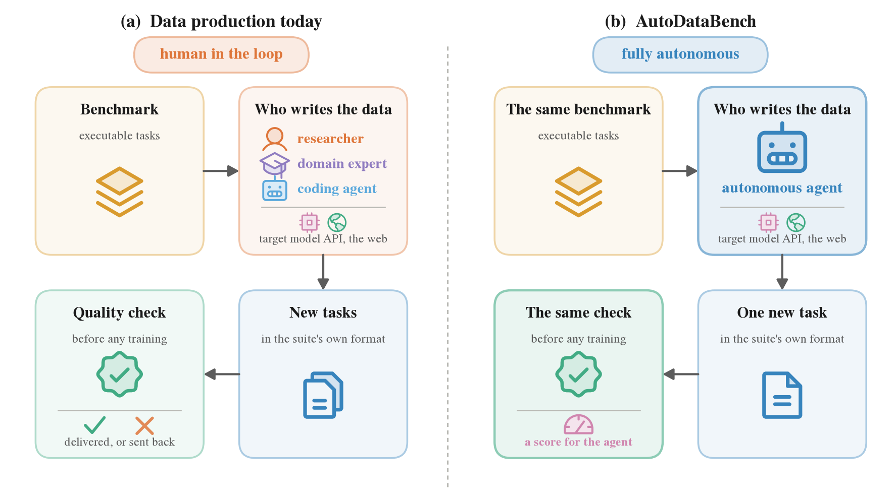
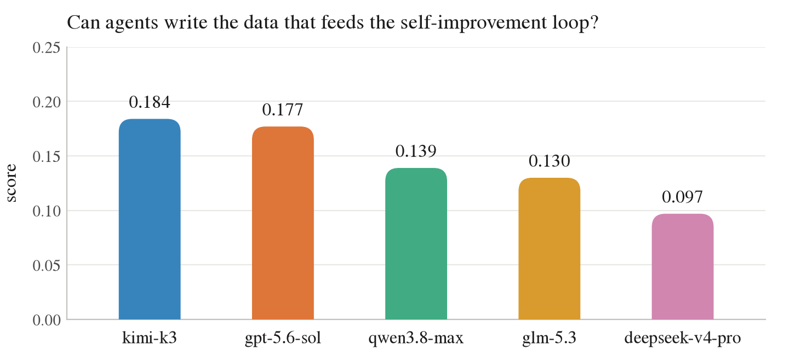
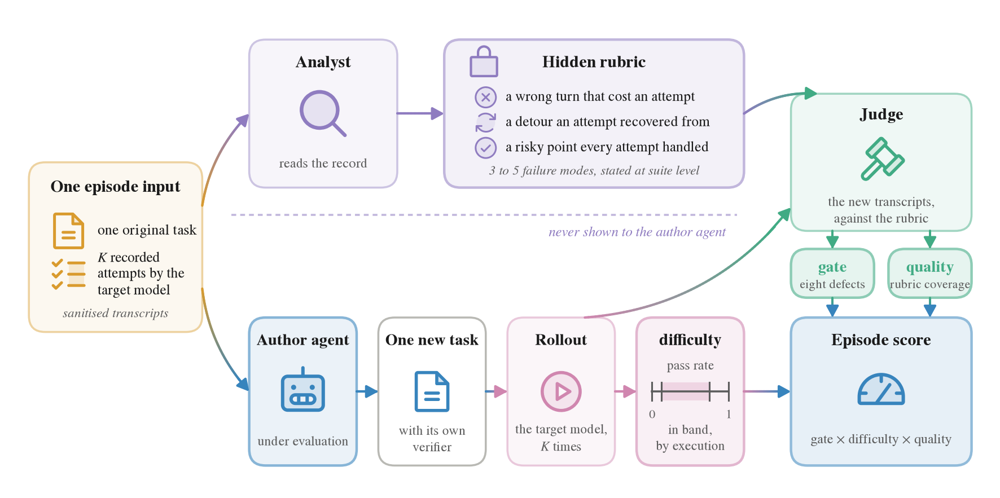

<h1 align="center">AutoDataBench</h1>

<p align="center">
  <b>Can agents write the data that feeds the self-improvement loop?</b>
</p>

<p align="center">
  <a href="#quick-start">Quick start</a> &nbsp;·&nbsp;
  <a href="#why-this-benchmark">Why</a> &nbsp;·&nbsp;
  <a href="#how-an-episode-works">How it works</a> &nbsp;·&nbsp;
  <a href="#scoring">Scoring</a> &nbsp;·&nbsp;
  <a href="LICENSE">Apache-2.0</a>
</p>

<p align="center">
  
</p>

Data production today is a team of people working alongside a coding agent, reading
an existing suite of executable tasks and writing new ones, which a quality check
accepts or sends back before any training run. AutoDataBench replaces that team with
the single agent under evaluation and holds everything else fixed: the suite, the
tools, and the check itself. Only the output of the check differs, a score for the
agent rather than a delivery decision.

<p align="center">
  
</p>

Five agents, each authoring against the same target model on the same 24 original
tasks. None passes 0.2, and the decomposition puts the failure away from targeting:
rubric coverage is close to saturated while the pass rate fails at both ends, with
delivered tasks tending to be solved on every attempt or on none.

## Quick start

Needs Python 3.11+, Docker, and [harbor](https://github.com/laude-institute/harbor).

```bash
export AUTODATABENCH_API_KEY=...        # your gateway key, never written to a config
export HARBOR_REAL=$(which harbor)
```

Then fill in two placeholders in `configs/default.json` — `gateway.base_url`, the
endpoint every role reaches its model through, and `sample.source_override`, needed
only if you resample the benchmark subset.

```bash
# prep, once per benchmark
python3 harness/run_rollout.py --benchmark tb-science    # target model attempts each original
python3 harness/run_analyst.py --benchmark tb-science    # its record becomes a hidden rubric

# the measurement, run as often as you like
python3 harness/run_episode.py --benchmark tb-science --episodes 3
python3 harness/aggregate.py   --run-id <run_id>
```

Output lands in `runs/<run_id>/<benchmark>/<task>/<ep>/`, one directory per episode,
with `score.json` at its root.

## Why this benchmark

**Capability now follows data.** Recent gains in language model capability have come
more from data than from architecture, and for agentic reinforcement learning the
unit of data is not a text pair but a task: an executable environment, a verifier
that decides whether the work was actually done, and a difficulty suited to the
model being trained. Producing such tasks is expert work, whether experts author
them directly or maintain the pipeline that generates them, which still needs their
judgement to say what a correct artifact looks like. Either way the volume of
training data is tied to the supply of experts. Automating the step would let
training data scale with compute instead, and it is an essential link in recursive
self-improvement: a model that writes the data used to train its successor removes
the last human from the loop, which leaves the quality of that data as the only
thing standing between such a loop and its own degradation.

**What a training pipeline requires of synthesised data.** A delivery is accepted
against criteria set in advance rather than against the outcome of a training run,
and not only for reasons of cost: the contribution of one task to one training run
is not separable from the data mixture, the schedule and the base model, so a
training-based verdict on a single artifact is unavailable in principle. Three
criteria stand in for it.

1. **Usable at all.** It runs in the suite's own format and is graded by a verifier
   that a wrong answer does not pass.
2. **Difficulty in range.** The target model's pass rate is non-zero and moderate; a
   task that is never solved and one that is always solved are both discarded.
3. **On target.** It elicits approximately the behaviour the original task elicited,
   because that behaviour is the reason the task was commissioned.

**Existing evaluations do not reproduce that setting.** Systems that synthesise
weakness-targeted environments are validated by downstream reinforcement-learning
gain, which is not a test any pipeline applies to a delivery and cannot separate the
authored data from the recipe applied to it. Benchmarks of research work either move
the deliverable, asking for a trained checkpoint rather than for data, or fix the
target before the run by scoring execution against goals written in advance, where a
data team is commissioned against a weakness not known until the model has been run.
Automatic benchmark construction optimises difficulty upwards rather than into a
range, since its object is an evaluation item. None of these protocols asks the
question a pipeline asks, which is whether this one artifact is fit to train on.

**AutoDataBench turns those three criteria into one term each.**

| criterion | term | how it is decided |
|---|---|---|
| usable at all | **gate** | a judge checks seven disqualifying defects |
| difficulty in range | **difficulty** | by execution: the target model attempts the new task K times |
| on target | **quality** | a judge reads the new task's transcripts against a hidden rubric |

An episode presents one original task together with a sanitised record of the target
model attempting it, and asks the agent under evaluation to deliver one new task for
the same suite. An analyst stage reduces that record to a short list of failure
modes, each naming a behaviour at a decision rather than a fact about the original
task; this list is the hidden rubric and the agent never sees it. The judge decides
mode by mode whether the new task placed the target model at that decision, taking
the new task's transcripts as evidence rather than the appearance of the task. The
target model is held fixed across every agent evaluated, so that scores are
comparable.

## How an episode works

| role | what it is | config key |
|---|---|---|
| **target model** | the model being trained; the one whose weaknesses we are trying to hit | `customer.model` |
| **agent under evaluation** | authors the new task | `researcher.model` |
| **analyst / judge** | read transcripts and decide what happened | `analyst.model`, `judge.model` |

The code calls the target model the *customer*, and that name appears in paths and
config keys.

<p align="center">
  
</p>

The analyst reduces the target model's record of the original task to a hidden
rubric, which the agent under evaluation never sees. The agent delivers one new
task; the target model then attempts it under that task's own verifier, which fixes
the difficulty term by execution. The judge reads those new transcripts, not the
task's appearance, and decides the gate and rubric coverage.

```
  1  sample      N tasks per benchmark, flattened, domain recorded in _meta.json
  2a rollout     target model attempts each original task K times
  2b analyse     analyst reads the subset + one task's transcripts -> hidden rubric
  ------------------------------------------------------------------ prep ends
  3a synthesize  agent sees the whole subset + ONE task's transcripts -> ONE new task
  3b score       target model rolls out the new task; judge scores coverage
```

The agent is given the whole sampled subset read-only, so it can learn the suite's
format and level from sibling tasks. It sees the transcripts for exactly one of
them, and delivers one task.

## Scoring

<p align="center">
  <b>score&nbsp; = &nbsp;gate &times; difficulty &times; quality</b>
</p>

The binary terms multiply rather than add because a task that leaks its answer and
a task the target model always solves are both unusable whatever their quality.

**gate** (0/1) — the seven defects in `rubrics/gate.md` that make a task unusable.
The one this exercise turns on is the **surface swap**: the delivered task being the
original with only its presentation changed, different values and names, the same
problem retold. Asking for one new task per original makes cloning the obvious
shortcut, so the gate names it explicitly. What it does *not* forbid is staying in
the original's problem family or turning on the same decision — that is what
targeting a failure mode means. The line is whether a solver of the original would
still have something to work out.

**difficulty** (0/1) — the target model attempts the delivered task K times, graded
by the task's own verifier. 1 when the solved rate lands inside
`[band_lo, band_hi]`. A task the target always solves and one it never solves are
both useless as training data.

**quality** ([0,1], judge) — coverage of the hidden rubric, judged from the **new
task's own transcripts**, not from how the new task looks. Per mode the judge
answers one yes-or-no question: did the new task exercise this mode. A mode is
`present` (the transcripts show the model at that decision; attempt, step and quote
required), `absent`, or `unreachable` (setup died before the stage was reached,
excluded from both numerator and denominator).

The score is not the raw fraction. A coverage target `a` counts as full marks:

    quality = min(1, covered / ceil(a * scoreable_modes))

At the default `a = 0.6`, three modes of a five-mode rubric score 1.0. One new task
cannot stage every mode of the task it was built from without being that task. The
judge is never told `a`: it answers per mode and the arithmetic stays in the
harness, because a judge that knew it only needed `a*N` modes would have a reason to
stop looking.

The judge also records what the model did at each present mode — failed, detoured,
handled, or mixed. That is kept for analysis and does not move the score: whether
the model then fails is what the difficulty term measures.

**format** ([0,1], judge) — mean of the eight checks in `rubrics/format.md`.
Measured and recorded in `score.json`, but **not scored**. Across in-band deliveries
it concentrates between 0.75 and 1.0, too narrow at any sensible weight to separate
agents; recomputing every score without it moved each agent by at most 0.007 and
changed no ordering. A delivery that fails the checks badly enough is unusable and
the gate catches it, which is a sharper instrument for the same concern. What the
term measured was hygiene among deliveries that were already well formed, and a task
can pass all eight checks and still be worthless.

`aggregate.py` averages episodes per original task first, then tasks into a
benchmark score, so a task that happened to get more repeats does not weigh more.
The spread across repeats is printed next to every mean.

## Configuration

Everything is in `configs/default.json`. Copy it to `configs/<name>.local.json`
(gitignored) and pass `--config` to override anything. The gateway key is never
committed: `api_key` stays `"env:AUTODATABENCH_API_KEY"` and is resolved from the
environment at load time, failing loudly if unset.

The agent gets a web search tool inside its container as `adb-search`, capped at
`researcher.search_max_calls` per session and logged next to its trajectory.
`researcher.search_script` points at a reference implementation; swap it for any
executable honouring the contract in that file's header.

## Two decisions the harness makes, not a model

**A verdict that does not match the schema is an error, not a low score.**
`run_score.validate_verdict()` checks the judge's output before any arithmetic runs.
Drift fails the episode loudly and it is re-judged. The reason is experience: silent
fallbacks used to absorb a renamed key and turn it into a plausible number, always
downwards. One verdict wrote `mode_id` instead of `id` for all five modes and was
recorded as quality 0.0 when the judge had marked every mode present. No aliases are
accepted, because accepting two would hide the next three.

**The surface-swap gate has a bright line the judge does not get to weigh.** Before
the judge starts, the harness writes a mechanical word-level diff of the two
`instruction.md` files and mounts it; the similarity and span count also land in
`score.json`. If every differing span is a renaming, the gate fires and no amount of
same-family reasoning overrides it. This exists because the softer wording was
reasoned around: a delivery differing from the original in ten spans, every one a
rename, was cleared as "the same family, materially different thing to work out".

## Licence

Apache-2.0; see [LICENSE](LICENSE). `benchmarks/` is third-party material under its
own terms, recorded in [ATTRIBUTION.md](ATTRIBUTION.md) together with the upstream
commit and sampling seed for each benchmark.
